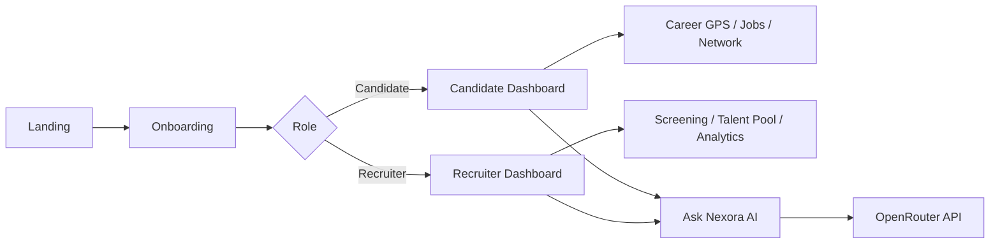

<div align="center">

# ✦ Nexora

### Beyond the CV. Discover Real Potential.

**AI-powered talent intelligence & career navigation platform** — bridging candidates and recruiters with skill-based matching, live interactivity, and an OpenRouter-powered career assistant.

<br />

[](https://react.dev/)
[](https://vitejs.dev/)
[](https://tailwindcss.com/)
[](https://zustand.docs.pmnd.rs/)
[](https://openrouter.ai/)

[](LICENSE)
[](https://github.com/saweramustafa117/nexora/pulls)
[-blueviolet?style=flat-square)](#)

<br />

[Live Demo](#) · [Features](#-features) · [Quick Start](#-quick-start) · [Deploy on Vercel](#-deploy-on-vercel) · [Report Bug](https://github.com/saweramustafa117/nexora/issues)

</div>

---

## 🌟 Overview

Nexora moves hiring beyond keyword-stuffed CVs. It evaluates **real skills**, **proof of work**, and **learning potential** — then gives both candidates and recruiters actionable, explainable insights.

| For Candidates | For Recruiters |
|:---:|:---:|
| Career GPS roadmap | Smart Screening table |
| Live skill match % | Talent Pool discovery |
| Gap Analysis + learning paths | AI candidate summaries |
| Job applications tracker | Analytics & hiring funnel |
| Networking suggestions | Post jobs + auto-match |

> Frontend-only prototype — all data lives in **Zustand** state initialized from mock JSON. Fully interactive within the browser session. Only real API: **OpenRouter** chatbot.

---

## ✨ Features

### 👤 Candidate Experience
- **Onboarding** — name + skill picker personalizes the dashboard
- **Summary cards** with animated count-up metrics
- **Career GPS** — interactive stepper: Skills → Careers → Gaps → Learning → Opportunities
- **Job Match Feed** — live `%` calculated from your skills vs job requirements
- **Gap Analysis modal** — radar chart, AI-style explanations, *Mark skill as learned* updates match scores instantly
- **Applications page** — track status with simulate-update demo
- **Opportunities feed** — filter by Jobs / Scholarships / Fellowships / Competitions / Mentorship + bookmark
- **Network** — connect flow with Pending → Connected states

### 🏢 Recruiter Experience
- **Smart Screening** — shortlist / reject with real-time tab filtering
- **Candidate drawer** — skill bars, proof-of-work chips, adaptability scores, AI summary
- **Post New Job** — form adds listings + auto-generates mock applicant matches
- **Talent Pool** — search & filter entire candidate database by skill, match %, potential
- **Analytics** — pie chart, hiring funnel, match distribution bar charts

### 🤖 Ask Nexora AI
- Floating chat bubble + full **Chat Assistant** page
- Powered by **OpenRouter** (`openrouter/free` model)
- Injects your live profile context (skills, applications, job matches) into every response
- Quick-prompt chips, typing indicator, retry on error

---

## 🛠 Tech Stack

```
React 19  ·  Vite 6  ·  Tailwind CSS 4  ·  React Router 7
Zustand   ·  Recharts  ·  Framer Motion  ·  Lucide React
OpenRouter API (chatbot only)
```

| Layer | Tools |
|-------|-------|
| UI | React, Tailwind CSS, Framer Motion, Lucide |
| State | Zustand (candidates, jobs, applications, chat) |
| Charts | Recharts (radar, bar, pie, funnel) |
| Routing | React Router v6/v7 |
| AI | OpenRouter via `fetch` |
| Build | Vite |

---

## 🚀 Quick Start

### Prerequisites
- Node.js 18+
- npm or pnpm

### 1. Clone & install

```bash
git clone https://github.com/saweramustafa117/nexora.git
cd nexora
npm install
```

### 2. Environment variables

Copy the example file and add your OpenRouter key:

```bash
cp .env.example .env
```

```env
VITE_OPENROUTER_API_KEY=your_key_here
VITE_OPENROUTER_MODEL=openrouter/free
```

> ⚠️ **Demo only** — `VITE_*` keys are bundled client-side. Use a backend proxy in production.

Get a free key at [openrouter.ai/keys](https://openrouter.ai/keys)

### 3. Run locally

```bash
npm run dev
```

Open **http://localhost:5173** → choose Candidate or Recruiter → complete onboarding → explore!

```bash
npm run build    # production build
npm run preview  # preview production build
```

---

## ☁ Deploy on Vercel

1. Push repo to GitHub
2. Import project on [vercel.com/new](https://vercel.com/new)
3. Framework preset: **Vite** (auto-detected)
4. Add environment variables in Vercel dashboard:

| Name | Value |
|------|-------|
| `VITE_OPENROUTER_API_KEY` | your OpenRouter API key |
| `VITE_OPENROUTER_MODEL` | `openrouter/free` |

5. Deploy — `vercel.json` handles SPA routing for React Router

---

## 🧮 Match Score Logic

Match percentages are **calculated live**, not hardcoded:

```js
calculateMatchPercentage(candidateSkills, jobRequiredSkills)
// Weighted overlap: candidate proficiency vs required importance per skill
```

When you mark a skill as learned in Gap Analysis, scores update across the entire UI.

---

## 📁 Project Structure

```
src/
├── components/       # UI — ChatWidget, CareerGPS, charts, modals…
├── pages/
│   ├── candidate/    # Dashboard, Opportunities, Applications…
│   ├── recruiter/    # Screening, Talent Pool, Analytics…
│   ├── Landing.jsx
│   ├── Onboarding.jsx
│   └── ChatPage.jsx
├── store/            # Zustand — user, candidates, jobs, chat
├── data/             # Mock JSON seeds
├── utils/            # Match calc, OpenRouter service, chat context
└── hooks/
```

---

## 🗺 App Flow



---

## 🎨 Design

- **Primary:** Indigo `#4F46E5`
- **Accent:** Cyan / Teal for match scores
- **Warnings:** Amber / Red for skill gaps
- Dark sidebar · light content · card-based SaaS layout
- Skeleton loaders · toast notifications · Framer Motion transitions

---

## 🤝 Contributing

Contributions, issues, and feature requests are welcome!

1. Fork the repo
2. Create your branch (`git checkout -b feature/amazing`)
3. Commit changes (`git commit -m 'Add amazing feature'`)
4. Push (`git push origin feature/amazing`)
5. Open a Pull Request

---

## 📄 License

This project is open source under the **MIT License**.

---

<div align="center">

**Built with purpose — because talent is more than a PDF.**

⭐ Star this repo if Nexora helped you!

[⬆ Back to top](#-nexora)

</div>
