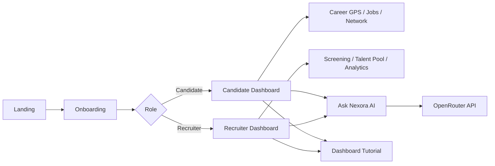

<div align="center">

# ✦ Nexora

### Beyond the CV. Discover Real Potential.

**AI-powered talent intelligence & career navigation** — skill-based matching, live dashboards, and an OpenRouter career assistant for candidates and recruiters.

<br />

[](https://nexora-one-lake.vercel.app)
[](https://react.dev/)
[](https://vitejs.dev/)
[](https://tailwindcss.com/)
[](https://zustand.docs.pmnd.rs/)
[](https://openrouter.ai/)

[](LICENSE)
[](#-mobile--desktop)
[](#-overview)
[](https://github.com/saweramustafa117/nexora/pulls)

<br />

**[Live Demo](https://nexora-one-lake.vercel.app)** · [Features](#-features) · [Quick Start](#-quick-start) · [Deploy](#-deploy-on-vercel) · [Structure](#-project-structure)

</div>

---

## 📋 Table of Contents

- [Overview](#-overview)
- [Features](#-features)
- [Mobile & Desktop](#-mobile--desktop)
- [Tech Stack](#-tech-stack)
- [Quick Start](#-quick-start)
- [Deploy on Vercel](#-deploy-on-vercel)
- [Match Score Logic](#-match-score-logic)
- [Project Structure](#-project-structure)
- [App Flow](#-app-flow)
- [Design](#-design)
- [Contributing](#-contributing)
- [License](#-license)

---

## 🌟 Overview

Nexora moves hiring beyond keyword-stuffed CVs. It evaluates **real skills**, **proof of work**, and **learning potential** — then gives both candidates and recruiters actionable, explainable insights.

| 👤 Candidates | 🏢 Recruiters |
|:---:|:---:|
| Career GPS roadmap | Smart Screening table |
| Live skill match % | Talent Pool discovery |
| Gap Analysis + learning paths | AI candidate summaries |
| Applications tracker | Analytics & hiring funnel |
| Networking suggestions | Post jobs + auto-match |
| Role-based AI coach | Hiring intelligence AI |

> **Frontend-only prototype** — data lives in **Zustand** state seeded from mock JSON. Fully interactive in the browser. The only live API is **OpenRouter** for the chat assistant.

---

## ✨ Features

### 👤 Candidate Experience

| Feature | Description |
|---------|-------------|
| **Onboarding** | Name + skill picker personalizes your dashboard |
| **Summary cards** | Animated metrics — profile strength, match score, applications |
| **Career GPS** | Stepper: Skills → Careers → Gaps → Learning → Opportunities |
| **Job Match Feed** | Live `%` from your skills vs job requirements |
| **Gap Analysis** | Radar chart, AI explanations, *Mark skill as learned* updates scores instantly |
| **Applications** | Track status with simulate-update demo |
| **Opportunities** | Filter Jobs / Scholarships / Fellowships / Competitions / Mentorship + bookmark |
| **Network** | Connect flow with Pending → Connected states |
| **Dashboard Tutorial** | 5-step guided tour — replay anytime from Settings |

### 🏢 Recruiter Experience

| Feature | Description |
|---------|-------------|
| **Smart Screening** | Shortlist / reject with tab filtering + candidate drawer |
| **Candidate drawer** | Skill bars, proof-of-work, adaptability scores, AI summary |
| **Post New Job** | Form adds listings + auto-generates mock applicant matches |
| **Talent Pool** | Search & filter by skill, match %, and potential |
| **Analytics** | Application quality, hiring funnel, match distribution charts |
| **Dashboard Tutorial** | Recruiter-specific guided tour |

### 🤖 Ask Nexora AI

- Floating chat bubble + full **Chat Assistant** page
- **Role-based prompts** — Career Coach (candidate) vs Hiring Intelligence (recruiter)
- Powered by **OpenRouter** (`openrouter/free` model)
- Injects live profile context (skills, applications, matches) into every response
- Quick-prompt chips, typing indicator, per-role chat history, retry on error

---

## 📱 Mobile & Desktop

Nexora is built **mobile-first** and works great on phones, tablets, and desktops:

| Area | Mobile | Desktop |
|------|--------|---------|
| **Navigation** | Hamburger menu + slide-out sidebar | Fixed sidebar always visible |
| **Top bar** | Compact role switcher (icons) | Full labels + company badge |
| **Tables** | Card views (Applications, Screening) | Full data tables with scroll |
| **Chat** | Near full-screen panel | Floating widget bottom-right |
| **Modals** | Bottom sheet style | Centered dialog |
| **Filters** | Horizontal scroll chips | Wrapped filter bar |

Switch between **Candidate** and **Recruiter** views anytime from the top bar — layout adapts automatically.

---

## 🛠 Tech Stack

```
React 19  ·  Vite 6  ·  Tailwind CSS 4  ·  React Router 7
Zustand   ·  Recharts  ·  Framer Motion  ·  Lucide React
OpenRouter API (chatbot only)
```

| Layer | Tools |
|-------|-------|
| UI | React, Tailwind CSS 4, Framer Motion, Lucide |
| State | Zustand — user, candidates, jobs, applications, chat |
| Charts | Recharts — radar, bar, pie, funnel |
| Routing | React Router v7 with protected routes |
| AI | OpenRouter via `fetch` + role-aware context |
| Build | Vite 6 with env injection for Vercel |

---

## 🚀 Quick Start

### Prerequisites

- **Node.js 18+**
- npm or pnpm

### 1. Clone & install

```bash
git clone https://github.com/saweramustafa117/nexora.git
cd nexora
npm install
```

### 2. Environment variables

```bash
cp .env.example .env
```

```env
VITE_OPENROUTER_API_KEY=your_key_here
VITE_OPENROUTER_MODEL=openrouter/free
```

Get a free key at [openrouter.ai/keys](https://openrouter.ai/keys)

> ⚠️ **Demo only** — `VITE_*` keys are bundled client-side. Use a backend proxy in production.

### 3. Run locally

```bash
npm run dev
```

Open **http://localhost:5173** → pick **Candidate** or **Recruiter** → complete onboarding → explore!

```bash
npm run build    # production build (checks OpenRouter env on Vercel)
npm run preview  # preview production build
```

---

## ☁ Deploy on Vercel

1. Push repo to GitHub
2. Import on [vercel.com/new](https://vercel.com/new) — preset **Vite** (auto-detected)
3. Add environment variables:

| Name | Value | Type |
|------|-------|------|
| `VITE_OPENROUTER_API_KEY` | your OpenRouter API key | **Config** (not Secret) |
| `VITE_OPENROUTER_MODEL` | `openrouter/free` | **Config** |

4. Deploy — `vercel.json` handles SPA routing for React Router

> Use **Config** type for `VITE_*` vars so Vite can inject them at build time. Redeploy after adding env vars.

**Live:** [nexora-one-lake.vercel.app](https://nexora-one-lake.vercel.app)

---

## 🧮 Match Score Logic

Match percentages are **calculated live**, not hardcoded:

```js
calculateMatchPercentage(candidateSkills, jobRequiredSkills)
// Weighted overlap: candidate proficiency vs required importance per skill
```

Mark a skill as learned in **Gap Analysis** → scores update across the entire UI instantly.

---

## 📁 Project Structure

```
src/
├── components/       # Layout, ChatWidget, CareerGPS, charts, modals, tutorial
├── pages/
│   ├── candidate/    # Dashboard, Opportunities, Applications, Career GPS…
│   ├── recruiter/    # Screening, Talent Pool, Analytics, Jobs…
│   ├── Landing.jsx
│   ├── Onboarding.jsx
│   └── ChatPage.jsx
├── store/            # Zustand — user, candidates, jobs, chat
├── data/             # Mock seeds (candidates, jobs, opportunities)
├── utils/            # Match calc, OpenRouter service, chat context
├── config/           # Env injection for Vercel builds
└── hooks/            # useSimulatedLoading, etc.
```

---

## 🗺 App Flow



---

## 🎨 Design

| Token | Value | Usage |
|-------|-------|-------|
| Primary | Indigo `#4F46E5` | Buttons, active nav, brand |
| Accent | Cyan `#06B6D4` | Match scores, highlights |
| Warning | Amber / Red | Skill gaps, alerts |
| Layout | Dark sidebar · light content | SaaS dashboard feel |

Skeleton loaders · toast notifications · Framer Motion transitions · responsive breakpoints (`sm`, `md`, `lg`)

---

## 🤝 Contributing

Contributions, issues, and feature requests are welcome!

1. Fork the repo
2. Create your branch (`git checkout -b feature/amazing`)
3. Commit changes (`git commit -m 'Add amazing feature'`)
4. Push (`git push origin feature/amazing`)
5. Open a Pull Request

---

## 📄 License

This project is open source under the **MIT License**.

---

<div align="center">

**Built with purpose — because talent is more than a PDF.**

⭐ Star this repo if Nexora helped you!

**[Live Demo →](https://nexora-one-lake.vercel.app)** · [⬆ Back to top](#-nexora)

</div>
